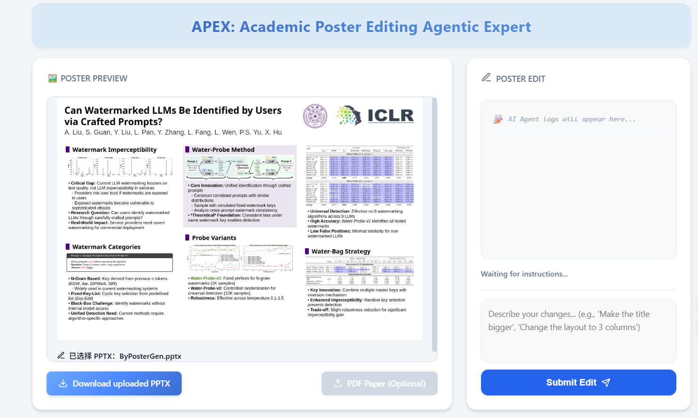
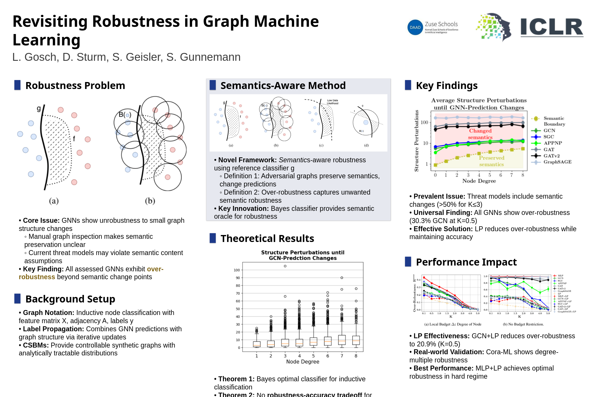
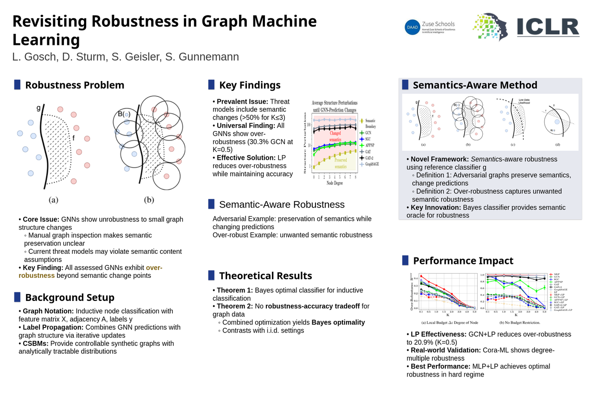
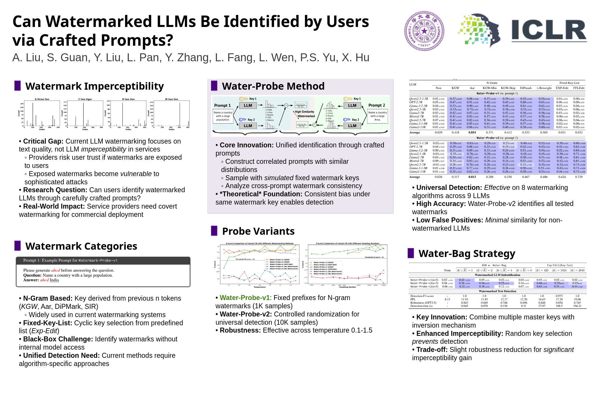
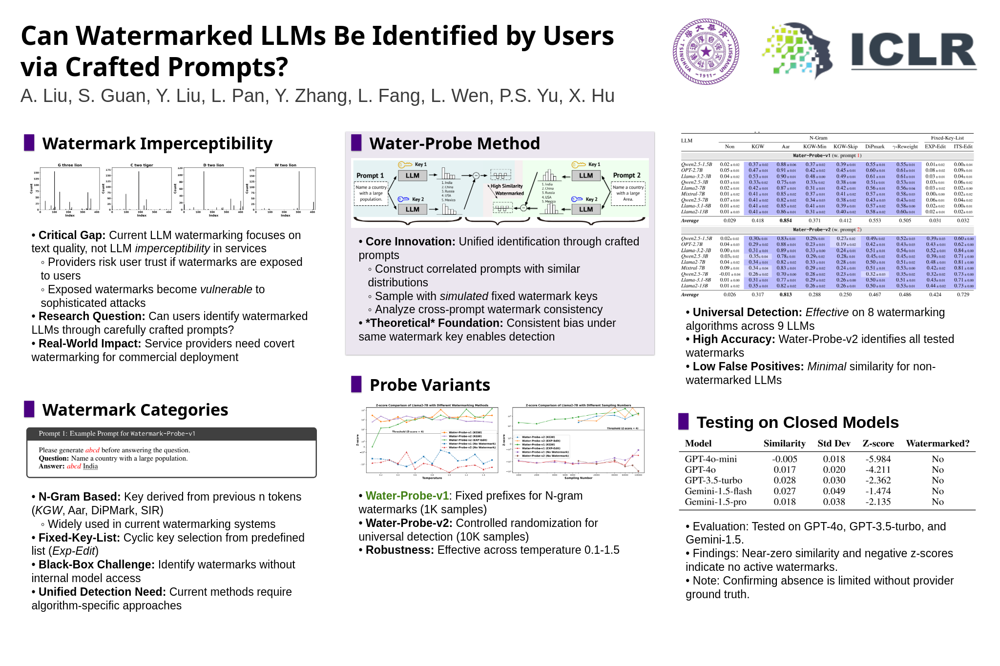
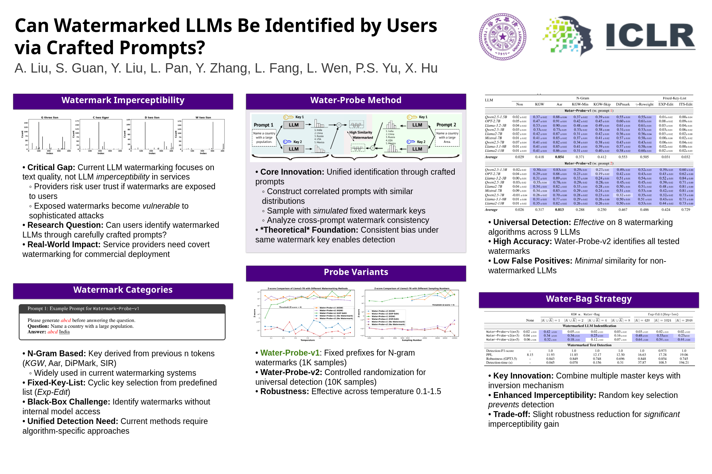

<div align="center">

  <!--  -->

  <h2>APEX: Academic Poster Editing Agentic Expert</h2>

  <p>
    APEX is a multi-agent framework for editing academic posters in <b>.pptx</b> format.
    Given an input PPTX and a natural-language instruction (optionally with a paper PDF),
    APEX parses the poster, plans edit actions, executes multi-level API for PPTX editing, and reviews, refines the result.
  </p>

  <p>
    <a href="https://arxiv.org/abs/2601.04794">
      
    </a>
    <a href="#">
      
    </a>
    <a href="#">
      
    </a>
    <a href="#">
      
    </a>
  </p>

</div>

---

## Overview

APEX provides an end-to-end workflow to **edit** an existing academic poster (PPTX):

- **PPTX parsing** into a structured Json representation.
- **Instruction-driven planning** that converts a user request into a sequence of editing API calls.
- **Optional paper understanding** (PDF) to rewrite or inject content based on the paper.
- **Review and Adjustment** to detect layout and other issues and apply fixes.
- **Evaluation utilities** (e.g., LangSmith-based judging/benchmark scripts).

---

## Repository Structure

- `src/` — core implementation
  - Workflow / entry:
    - `src/graph.py` — LangGraph workflow builders (e.g., `create_poster_edit_graph_v3`)
    - `src/schema.py` — state & data models (`AgentState`)
  - Agents:
    - `src/agents/planner.py` — edit planning (`planning_code_with_tools`)
    - `src/agents/code_generator.py` — execution agent (`code_generation_execution_agent_api`)
    - `src/agents/paper_understanding.py` — paper tools (`create_paper_understanding_tool`)
    - `src/agents/reviewer.py` — reviewer & adaptive fixes (`review_adaption_agent`)
  - Tools:
    - `src/tools/api_doc.py` — editable API documentation
    - `src/tools/pptx_execuator.py` — API executor + PPTX operations
    - `src/tools/pdf_parser.py` — PDF parsing / asset extraction (`extract_paper_content`)
    - `src/tools/utils.py` — JSON extraction/cleanup helpers (e.g., `_extract_first_json_object`)
- `src/prompts/` — prompt templates (planner/reviewer/judge, etc.)
- `src/evaluation/` — evaluation scripts
- `scripts/` — helper scripts (benchmark/judge)

---

## System Requirements

- **OS**: Windows, Linux 
- **Python**: 3.10+ (recommended: 3.11)
- **LibreOffice**: required for some PPTX export/convert workflows

### Install LibreOffice

**Ubuntu / Debian**
```bash
sudo apt install libreoffice
```

### Python Environment Setup
Create an environment named poster_edit:
````bash
Option A: Conda (recommended)
conda create -n poster_edit python=3.11 -y
conda activate poster_edit

pip install -r requirements.txt

````


### API Keys
Create a .env file in the project root:
````bash   
export ALIBABA_API_KEY="your_key"  # for Qwen
export GOOGLE_API_KEY="your_key"
export LANGSMITH_API_KEY="your_key"  # optional
````

Optional base URLs (if using compatible services / self-hosted endpoints):
````bash
export ALIBABA_BASE_URL="https://your-endpoint/v1"  # for Qwen
export ANTHROPIC_BASE_URL="https://your-endpoint"
export GOOGLE_BASE_URL="https://your-endpoint"
````    
### Quick Start (CLI)

#### Backend Setup in Linux

1. (Optional) Create and activate a virtual environment.
2. Install Python dependencies:
   ```bash
   pip install -r requirements.txt
   ```
3. Start the backend server in linux:
   ```bash
   python start_backend.py --model gemini-3-flash-preview
   ```
    You can replace `--model` with qwen3-vl-plus. However, we strongly recommend using gemini-3-flash-preview since it has better performance while the cost is affordable.

The backend will be available at `http://localhost:8000` (default FastAPI port).

#### Frontend Setup in Windows

1. Navigate to the `frontend` directory:
   ```bash
   cd frontend
   ```
2. Install dependencies (first time only):
   ```bash
   npm install
   ```
3. Start the development server:
   ```bash
   npm run dev
   ```

The frontend will usually be available at `http://localhost:5173`.

### How It Works (High-Level)
APEX follows a design-like workflow:
1. Parse the PPTX into structured elements
2. Plan a sequence of editing operations from the instruction.
3. Execute operations via a controlled PPTX-editing API layer.
4. Review & Adjustment to fix overflow, misalignment, inconsistent typography, etc.

### Evaluation
Evaluation scripts live in:

- src/evaluation/

If you use LangSmith-based evaluation, set LANGSMITH_API_KEY in .env.
### UI

### Cases (gemini-3-flash-preview)
#### 1. 
(1) **poster made by using PosterGen:** 
poster made by using PosterGen:


(2) **user's instruction:** 
Swap the positions of the "Semantics-Aware Method" section and the "Key Findings" section. Then restructure the "Key Findings" section into two equally wide left and right columns: place the textual content of the "Key Findings" section in the left column and the images in the right column. Remove the images from the "Theoretical Results" section. Insert a new section named "Semantic-Aware Robustness" between the two sections in the middle column, using two separate lines of text to introduce "Adversarial Example" and "Over-robust Example" respectively. Finally, adjust the spacing of the middle column so that it is visually appropriate, with no overlap or overflow.
(3) **Edited Poster:**



#### 2.
(1) **poster made by using PosterGen:**

(2) **user's instruction: replace the right-bottom section with section related to testing on close models**

(3) **Edited Poster:**

#### 3.
(1) **poster made by using PosterGen:**

(2) **user's instruction: Redesign section headers to use a solid purple background with smaller, white text, replacing the original purple box style to increase prominence.**

(3) **Edited Poster:**



### Troubleshooting
- LibreOffice errors: ensure LibreOffice is installed and available on PATH.
- PDF parsing issues: verify PDF tool dependencies (e.g., docling, pdf2image) are installed.
- JSON parsing failures from LLM output: APEX includes JSON cleanup/extraction utilities in src/tools/utils.py.
- Note that when making paper-related editing, the first run may take longer due to using Docling to extract images/table in paper, we will consider use more efficient parsing methods in future releases or directly use paper assets cache from automated paper2poster generation methods like PosterGen.
- We strongly **recommend using gemini-3-flash-preview** since it's cost-efficient and performs well.


### Acknowledgements
This project relies on the open-source ecosystem, including (but not limited to):
- LangGraph / LangChain for multi-agent workflows
- python-pptx for PPTX manipulation
- Docling for PDF parsing and asset extraction
- PosterGen for poster generation

### Citation
```bash
@misc{shi2026apexacademicposterediting,
      title={APEX: Academic Poster Editing Agentic Expert}, 
      author={Chengxin Shi and Qinnan Cai and Zeyuan Chen and Long Zeng and Yibo Zhao and Jing Yu and Jianxiang Yu and Xiang Li},
      year={2026},
      eprint={2601.04794},
      archivePrefix={arXiv},
      primaryClass={cs.AI},
      url={https://arxiv.org/abs/2601.04794}, 
}
```
